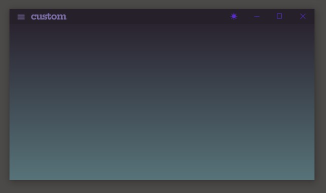

# try_bitsdojo

Custom windows for Flutter desktop app.

## Getting Started

This project is just a place to experiment with a working Flutter application where you can try out and customize your Flutter desktop app window.

This project uses the [bitsdojo/bitsdojo_window](https://github.com/bitsdojo/bitsdojo_window)
 package to create a custom window for the application.

